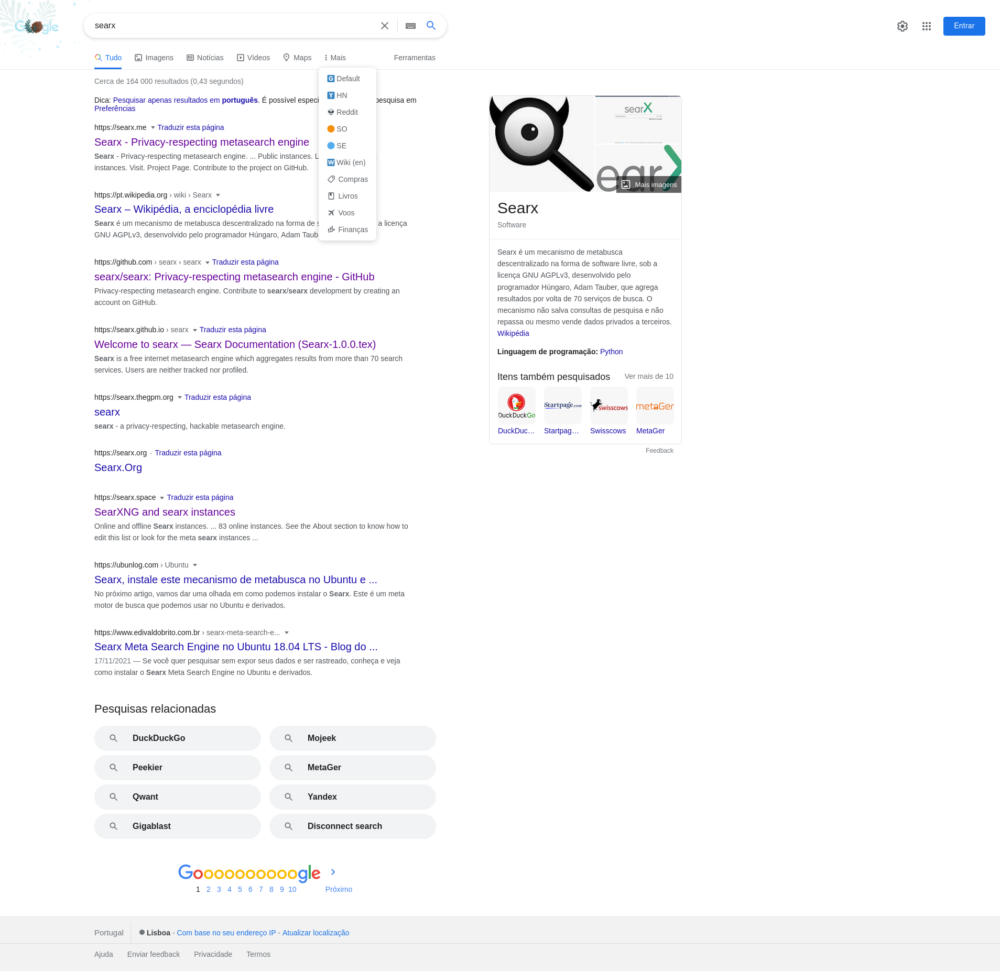
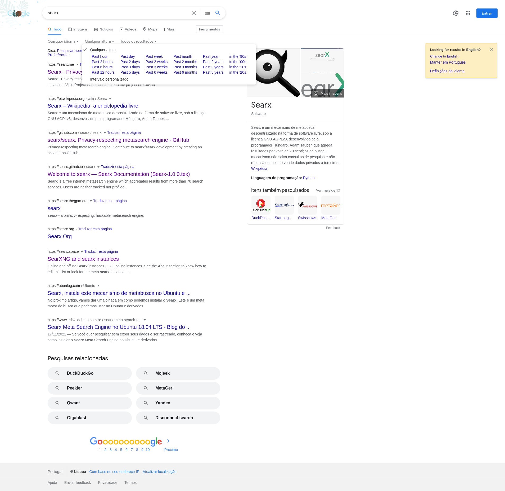
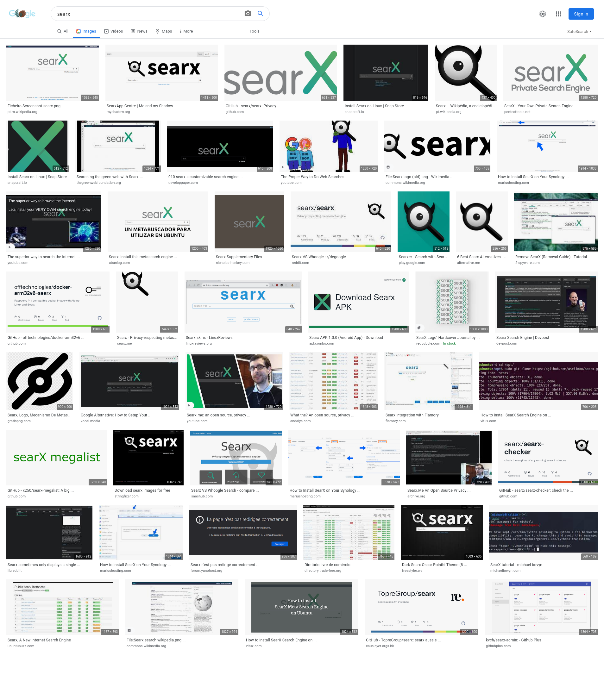
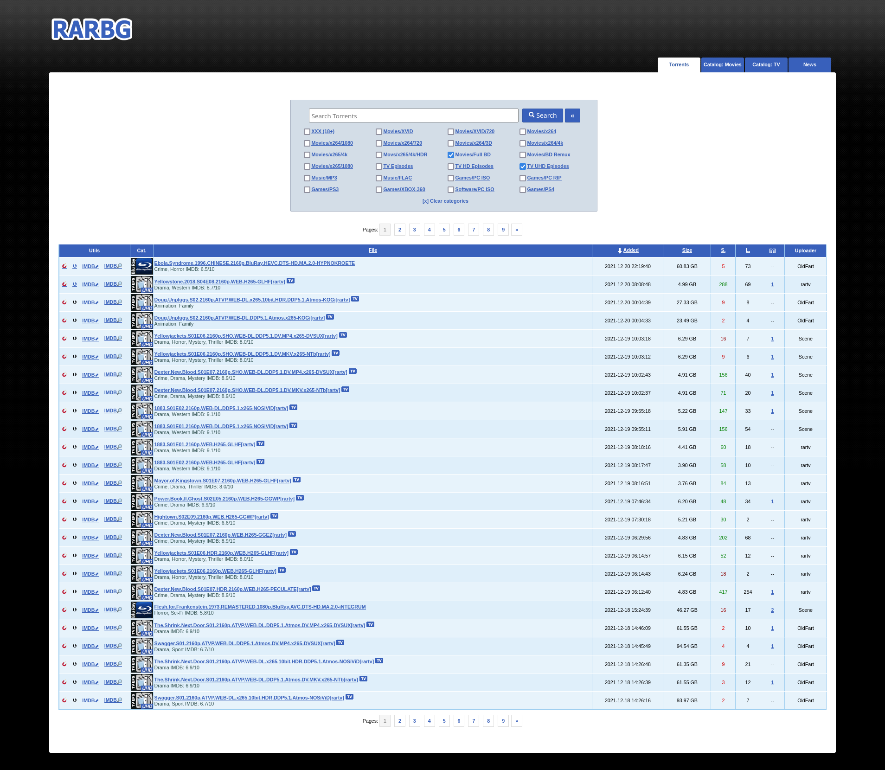
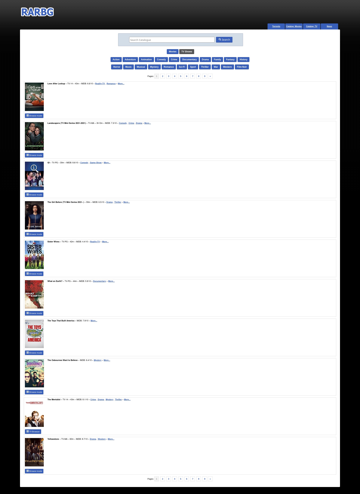
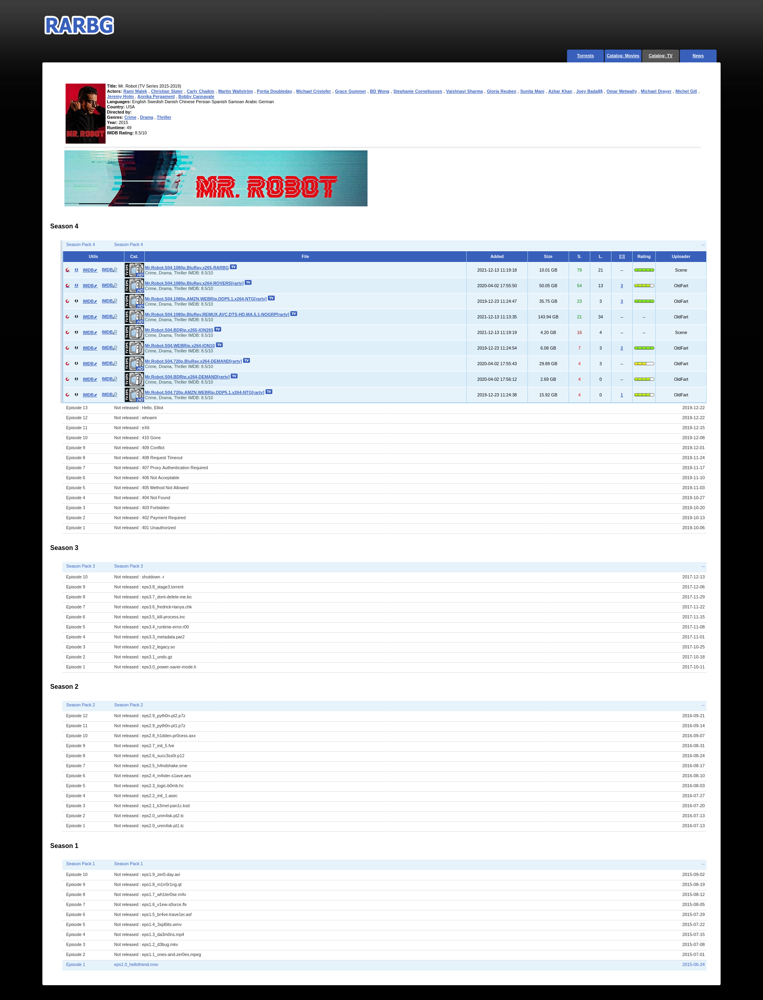
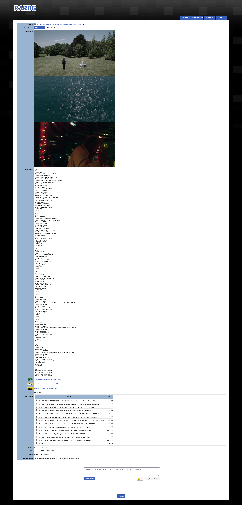

# Userscripts

Some userscripts I have been using in Firefox with [Violentmonkey](https://violentmonkey.github.io/), an open source userscript manager.

---

## About

These userscripts are meant to stay relatively simple.
I have no interest in maintaining "comprehensive overhaul suites".

Furthermore, these userscripts may or may not work correctly in Chromium-based browsers.
I could not care less about that.

Each script's description below includes screenshots to better showcase the changes they make to the websites.

---

## Script list and description

### **Google enhancement scripts**

If you haven't migrated away from Google search yet, these scripts will help make the experience of using it less miserable.

#### **Google custom search buttons**

Adds search buttons to repeat the search but showing only results from certain sites.

It is based on the [userscript originally written by Mario O. M.](https://github.com/marioortizmanero/reddit-search-on-google).

Show preview

 

#### **Google custom time periods**

Adds more time periods/ranges to Google's search options.

It is based on the [userscript originally written by "knoa"](https://greasyfork.org/en/scripts/31256-google-search-various-timePeriods/code).

Show preview

 

#### **Google images resolution info**

Reintroduces image dimensions on thumbnails in the Google Image Search results page.

It is based on the [userscript originally written by Tad Wohlrapp](https://github.com/tadwohlrapp/google-image-search-show-image-dimensions-userscript).

Show preview

 

### **RARBG enhancer**

Opinionated improvements to the layout and functionality of RARBG pages with a focus on usability and minimalism.

- Site chrome: removes recommended torrents, the login form, and all buttons except for the homepage button, and the "Torrents", "Catalog" and "News" buttons at the top
  Additionally, the "Catalog" button is split into 2, one directly for Movies and another for TV Shows.
- Catalog page: removes "preview" torrent tables from each entry entirely (I always want to go into the respective TV Browser pages to check out all of the available torrents).
- Torrent tables in torrent search page and TV browser pages: adds a "Utils" column with some useful buttons
  - Download magnet (available on mouse over near the icon)
  - Download torrent (available on mouse over near the icon)
  - Open external IMDB page (if applicable)
  - Search by IMDB ID (if applicable) without the confusing yellow IMDB icon that makes it seem it will open an external IMDB page instead
- Torrent details pages: removes the "related torrents" tables and other elements I don't find useful.
  Additionally, `mediainfo`, `list of files` and `nfo` summaries are auto-expanded on page load.

Show previews

 

---

## Development

See [ARCHITECTURE.md](ARCHITECTURE.md) for details about how the scripts work and their implementation details.

---

## License

[AGPLv3 or later](LICENSE.txt).
