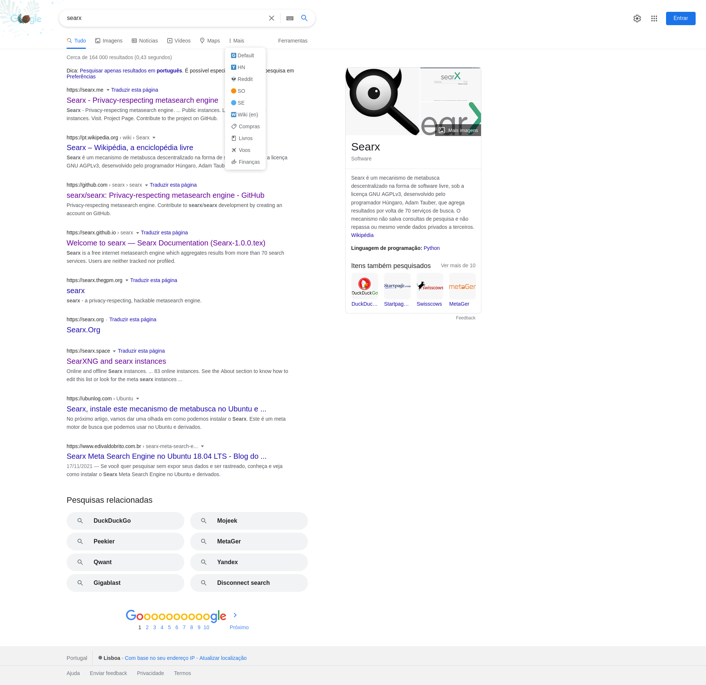
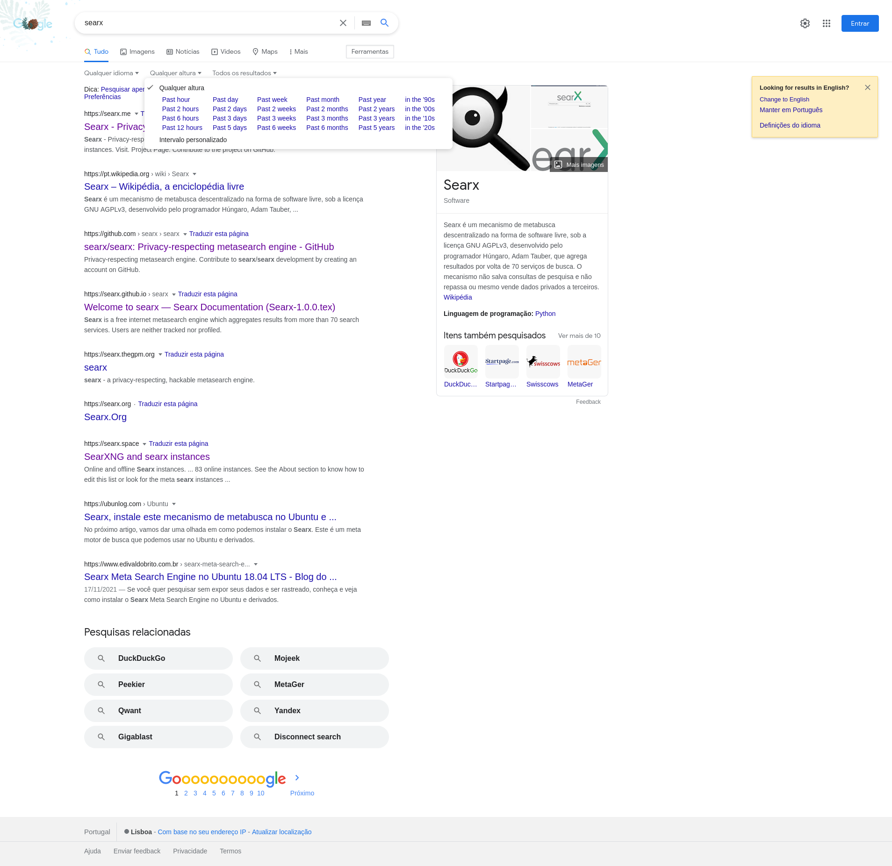
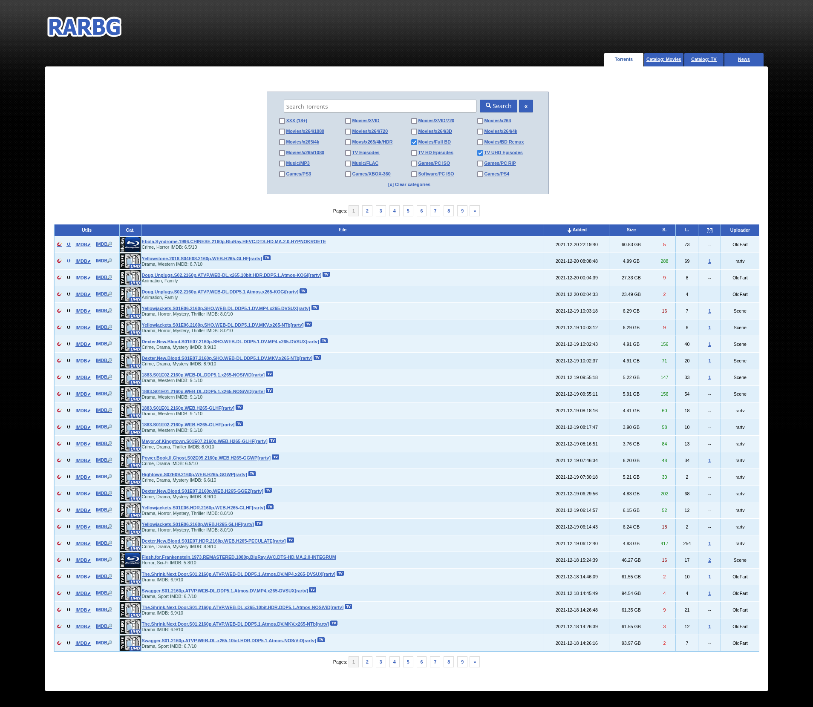
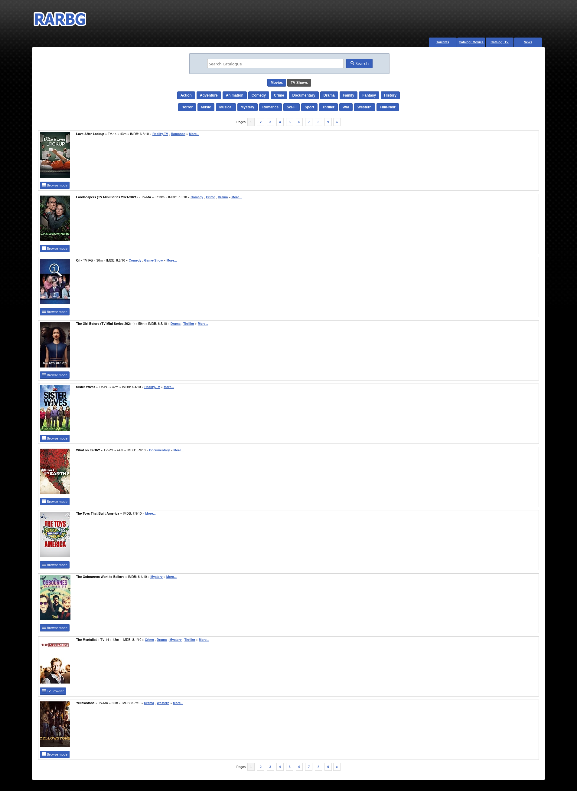
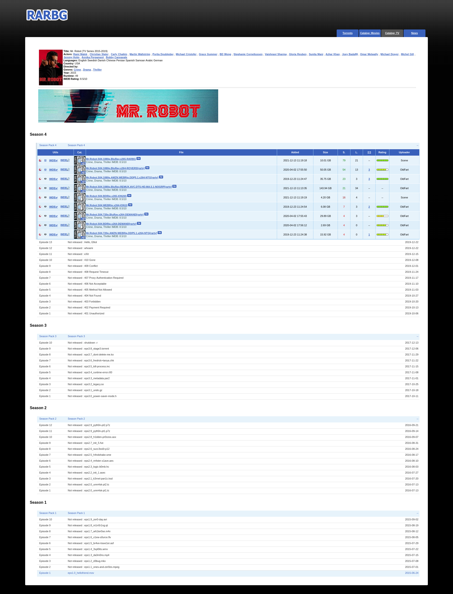
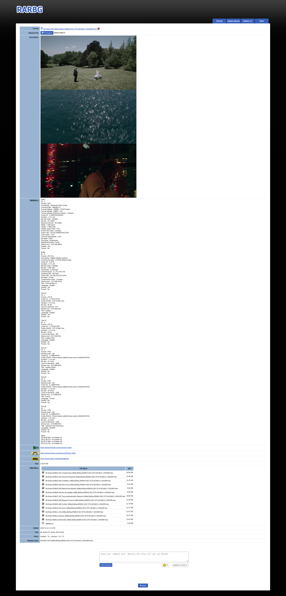

# Userscripts

Some userscripts I have been using in Firefox with [Violentmonkey](https://violentmonkey.github.io/), an open source userscript manager.

---

## About

These userscripts are meant to stay relatively simple.
I have no interest in maintaining "comprehensive overhaul suites".

Furthermore, these userscripts may or may not work correctly in Chromium-based browsers.
I could not care less about that.

Each script's description below includes screenshots to better showcase the changes they make to the websites.

---

## Script list and description

### **Google enhancement scripts**

If you haven't migrated away from Google search yet, these scripts will help make the experience of using it less miserable.

#### **Google custom search buttons**

_No longer maintained._

Adds search buttons to repeat the search but showing only results from certain sites.

It is based on the [userscript originally written by Mario O. M.](https://github.com/marioortizmanero/reddit-search-on-google).

<details>
<summary>Show preview</summary>



</details>
<br/>

#### **Google custom time periods**

_No longer maintained._

Adds more time periods/ranges to Google's search options.

It is based on the [userscript originally written by "knoa"](https://greasyfork.org/en/scripts/31256-google-search-various-timePeriods/code).

<details>
<summary>Show preview</summary>



</details>
<br/>

#### **Google images resolution info**

_Unmaintained for a long time, likely currenlty broken._

Reintroduces image dimensions on thumbnails in the Google Image Search results page.

It is based on the [userscript originally written by Tad Wohlrapp](https://github.com/tadwohlrapp/google-image-search-show-image-dimensions-userscript).

<details>
<summary>Show preview</summary>


</details>
<br/>

### **RARBG enhancer**

_No longer relevant, the website died._

Opinionated improvements to the layout and functionality of RARBG pages with a focus on usability and minimalism.

- Site chrome: removes recommended torrents, the login form, and all buttons except for the homepage button, and the "Torrents", "Catalog" and "News" buttons at the top
  Additionally, the "Catalog" button is split into 2, one directly for Movies and another for TV Shows.
- Catalog page: removes "preview" torrent tables from each entry entirely (I always want to go into the respective TV Browser pages to check out all of the available torrents).
- Torrent tables in torrent search page and TV browser pages: adds a "Utils" column with some useful buttons
  - Download magnet (available on mouse over near the icon)
  - Download torrent (available on mouse over near the icon)
  - Open external IMDB page (if applicable)
  - Search by IMDB ID (if applicable) without the confusing yellow IMDB icon that makes it seem it will open an external IMDB page instead
- Torrent details pages: removes the "related torrents" tables and other elements I don't find useful.
  Additionally, `mediainfo`, `list of files` and `nfo` summaries are auto-expanded on page load.

<details>
<summary>Show previews</summary>









</details>
<br/>

### **Slayers Club Rating-Country Mapping Patcher** And **Slayers Club News Limit Patcher**

_No longer relevant, the website functionality these userscripts targeted has been removed._

We used these a long time ago to patch breakage on Bethesda's Slayers Club website to be able to click on "share" links on the site's articles that were otherwise inaccessible.
Clicking such links while logged in credited our account with points that were necessary to unlock some cosmetic items in Doom Eternal.

### **Hacker News Enhancer**

Quick and low-effort dark theme for the Orange Website.

### **GitHub Bulk Unsubscribe Closed Issues**

Currently, GitHub does not have an API endpoint to manage [notification subscriptions](https://github.com/notifications/subscriptions).
This userscript adds a button to check all closed/merged issues and PRs on the current page, to facilitate bulk unsubscribing of those items.

---

## Development

See [ARCHITECTURE.md](ARCHITECTURE.md) for details about how some of the scripts work and their implementation details.

---

## License

[AGPLv3 or later](LICENSE.txt).

```txt
Userscripts - personal collection of userscripts for use with Violentmonkey
Copyright (C) 2021  Francisco Pombal <pombal.francisco@gmail.com>

This program is free software: you can redistribute it and/or modify
it under the terms of the GNU Affero General Public License as published
by the Free Software Foundation, either version 3 of the License, or
(at your option) any later version.

This program is distributed in the hope that it will be useful,
but WITHOUT ANY WARRANTY; without even the implied warranty of
MERCHANTABILITY or FITNESS FOR A PARTICULAR PURPOSE.  See the
GNU Affero General Public License for more details.

You should have received a copy of the GNU Affero General Public License
along with this program.  If not, see <https://www.gnu.org/licenses/>.
```
